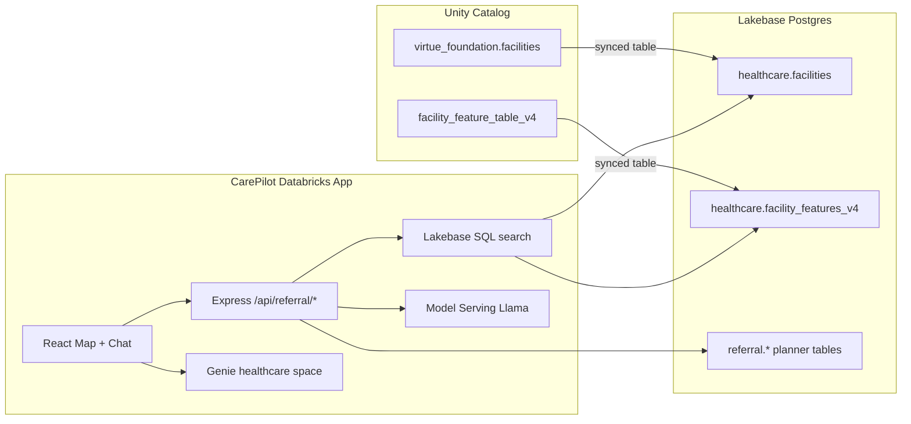

# CarePilot Referral Copilot

Evidence-aware healthcare facility referral copilot for India — map, ranked candidates, OSRM routes, and Databricks-powered summaries.

**Live app:** https://carepilot-2975424914277074.aws.databricksapps.com

Built on [Databricks AppKit](https://databricks.github.io/appkit/) with **Lakebase Postgres**, **Unity Catalog synced tables**, **Genie**, and **Model Serving** (Llama 4 Maverick).

## What it does

- **Referral search** — natural language (`dialysis near Jaipur`) → evidence-ranked facility list + map markers
- **Lakebase SQL scoring** — `facilities` ⨝ `facility_features_v4` (UC sync) with trust, NFHS local-need, distance, and evidence signals
- **Planner workspace** — shortlist, notes, review decisions, overrides persisted in Lakebase `referral` schema
- **Routes** — OSRM driving ETA overlays
- **Genie tab** (production) — ad-hoc queries on Virtue Foundation + NFHS datasets
- **Llama summaries** — search recap and candidate card explanations via Model Serving

> Planner-facing tool — not medical advice. Verify before referral.

## Data flow



## Deploy (Databricks App)

### Prerequisites

- Databricks CLI authenticated (`databricks auth login`)
- Lakebase project bound in `databricks.yml`
- UC synced tables: `healthcare.facilities`, `healthcare.facility_features_v4` (see `docs/v4-scoring-integration.md`)
- Model Serving endpoint: `databricks-llama-4-maverick` (or update `serving_endpoint_name` in `databricks.yml`)

### Commands

```bash
export DATABRICKS_CONFIG_PROFILE=DEFAULT
cd CarePilot
npm install
npm run deploy
```

`npm run deploy` runs bundle sync → `databricks bundle deploy` → `databricks bundle run app`.

**Do not set `CAREPILOT_LOCAL_DEMO` in production** — the app loads Lakebase + Genie automatically.

### Runtime env (app.yaml)

| Variable | Source |
|----------|--------|
| `LAKEBASE_ENDPOINT` | Lakebase postgres resource |
| `DATABRICKS_GENIE_SPACE_ID` | Genie space resource |
| `DATABRICKS_WAREHOUSE_ID` | SQL warehouse |
| `DATABRICKS_SERVING_ENDPOINT_NAME` | Serving endpoint |
| `CAREPILOT_LLM_MODEL` | `databricks-llama-4-maverick` |

## Local development

### Production-parity (Lakebase SQL)

Unset `CAREPILOT_LOCAL_DEMO`, configure Lakebase credentials in `.env`, and run:

```bash
npm run dev
```

### Quick demo (Python CSV bridge)

```bash
# .env
CAREPILOT_LOCAL_DEMO=1
CAREPILOT_USE_PYTHON_BRIDGE=1
CAREPILOT_BACKEND_DIR=/path/to/carepilot-referral
CAREPILOT_BACKEND_CSV=/path/to/clean_facilities_v4.csv
```

Optional: `CAREPILOT_ENABLE_GENIE=1` to show the Genie tab locally (requires Genie credentials).

## Demo script (judges / stakeholders)

1. Open the app → **Plan your trip** sidebar pre-filled: `Jaipur` + `dialysis`
2. Click **Search** — ranked candidates appear on map and list
3. Click **Hide** — form collapses; **Ranked results · N** moves up
4. Select a facility → open evidence card → **Route** for OSRM ETA
5. Chat: ask *"why is #1 ranked highest?"* — Llama follow-up
6. Switch to **Genie data** tab → ask about NFHS indicators or facility counts

## Project layout

| Path | Role |
|------|------|
| `server/lib/lakebase-referral-search.ts` | Lakebase SQL candidate retrieval |
| `server/lib/referral-scoring.ts` | Evidence-aware ranking (TypeScript) |
| `server/lib/lakebase-referral-store.ts` | Planner persistence in Lakebase |
| `server/lib/referral-llm.ts` | Model Serving summaries |
| `server/routes/referral-routes.ts` | `/api/referral/*` HTTP API |
| `client/src/pages/ChatPage.tsx` | Map + Referral/Genie chat layout |
| `docs/DEPLOY_AND_DEMO.md` | Extended deploy + sync checklist |
| `docs/v4-scoring-integration.md` | UC → Lakebase sync for v4 scores |

## API

| Endpoint | Description |
|----------|-------------|
| `POST /api/referral/parse` | NL → structured search params |
| `POST /api/referral/search` | Lakebase SQL + ranked candidates |
| `GET /api/referral/status` | Engine mode (`lakebase_sql` / `python_bridge`) |
| `GET /api/map/facilities` | Map markers with trust scores |
| `POST /api/route/mock` | OSRM route polyline + ETA |

See `docs/referral_score_calculation.md` for scoring detail.
